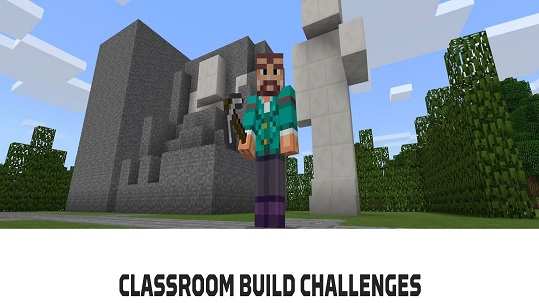

## **REFLEXIONAR**

En este curso, usted aprendió que los Desafíos de Construcción de Minecraft: Edición Educativa:

*   Ofrecen una excelente forma de involucrar a estudiantes y educadores en proyectos creativos y resolución de problemas.
*   Inspiran a los estudiantes con contenido esencial y habilidades del siglo 21.
*   Se pueden acceder a través del modo de juego y el sitio web.
*   Ofrecen descripción, objetivo y extensión tanto en el modo de juego como en el sitio web.
*   Se pueden utilizar en grupos completos, pequeños grupos o individualmente.

Usted tuvo la oportunidad de probar un Desafío de Construcción de Aula de Minecraft: Edición Educativa y comenzó a ver cómo aplicar desafíos de construcción en su salón de clases. Durante este curso:

*   Aprendió cómo motivar la creatividad de los estudiantes en clase utilizando los Desafíos de Construcción.
*   Experimentó la construcción y creación en Minecraft: Edición Educativa para lograr un objetivo de aprendizaje y completar una tarea desafiante.
*   Reflexionó sobre los objetivos de aprendizaje vinculados a Minecraft: Edición Educativa.

Comparta sus pensamientos (y lo que ha aprendido) tuiteando los hashtags [#MinecraftEDU](https://twitter.com/search?f=tweets&vertical=default&q=%23minecraftedu&src=typd) [@PlayCraftLearn](https://twitter.com/search?q=%40PlayCraftLearn&src=typed_query) en Twitter.

Información adicional: El documento de recursos de Minecraft: Edición Educativa está disponible en el siguiente enlace:   [Recursos del curso.](https://redqualitasedu-my.sharepoint.com/:b:/g/personal/ppenalva_redqualitas_edu_uy/ET6oMMgA2DFMjCluRAjASKgBTQctbGEJJJ_sWijBYc-yHA?e=NdMqxH)   
  

## **PRÓXIMO PASO**

¡Felicitaciones! Usted concluyó Minecraft **Aprenda a Jugar: Desafíos de Construcción de Clases.** Ahora está listo para hacer el **cuestionario**.