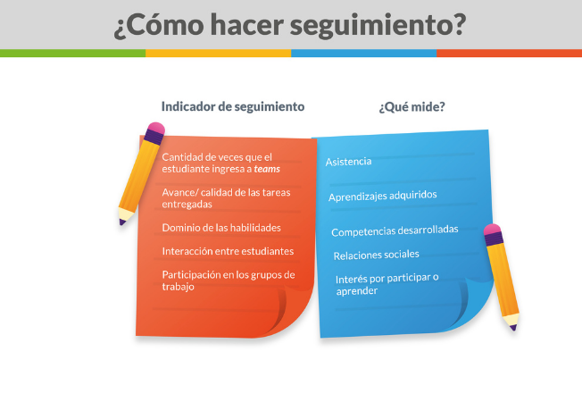

Al igual que en los espacios de aprendizaje presencial, en las instancias remotas de aprendizaje la atención y el seguimiento personalizado a los estudiantes es uno de los factores que inciden en los resultados, saber cuánto y cómo avanzan. Las decisiones que tomes como docente deben estar fundamentadas en evidencias objetivas y para ello realizar seguimiento es una tarea fundamental. Como docentes la tarea no solo consiste en entregar contenidos, se debe velar por el desarrollo integral del estudiante; cuanto a aprendido, cuáles son las habilidades que ha desarrollado y cómo ha sido su interacción con los otros estudiantes.

Para realizar ese seguimiento te proponemos los siguientes indicadores:

[DESCARGUE INFOGRAFÍA AQUÍ](https://redqualitasedu-my.sharepoint.com/:i:/g/personal/ppenalva_redqualitas_edu_uy/ETD58fipnGxHrFW9qEjJTK4By6SNsqx3BA80BUB82QGWLQ?e=M5Fbvt)

**Preguntas para la  reflexión pedagógica:**

1.  **¿Qué aspectos de la educación integral estás potenciando hoy en tus estudiantes?**
2.  **¿Cómo estás abordando a los estudiantes que presentan dificultades?**
3.  **¿Qué herramientas podrías desarrollar para mejorar tu desempeño como docente en contexto remoto?**