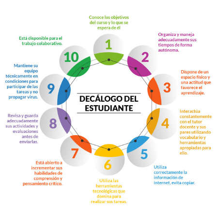

Así como para ti en tu rol de docente este es un camino nuevo y que requiere de una modificación de tu rol, para el estudiante es bastante similar, en un contexto de clases presenciales tú dispones de muchas herramientas para atraer su atención , el sólo hecho de desplazarte por la sala de clases constituye un factor que puede ayudarle a mantener la atención. **En un contexto de clases virtuales o remotas, su autogestión del tiempo y la motivación es una habilidad que deberán desarrollar.**

Una forma de poder ayudar a los estudiantes a trabajar en contextos no presenciales es que ellos sepan claramente qué se espera de ellos en cuanto a su disposición al trabajo, reglas de convivencia y conducta en el curso. Para facilitar ese trabajo te proponemos entregar un decálogo como el siguiente:

[DESCARGUE INFOGRAFÍA AQUÍ](https://redqualitasedu-my.sharepoint.com/:i:/g/personal/ppenalva_redqualitas_edu_uy/ESp1G4pMCiRDgZAAL-rhHDcBSeeXSL9mOwsR1ycrg1-vbA?e=bOctYZ)