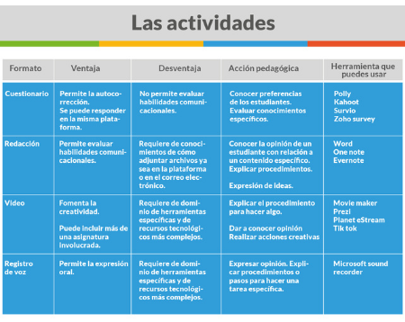

Las diferentes actividades  (cuestionarios, tareas en diferentes formatos como presentaciones, ensayos, videos, registros de voz) y la entrega de actividades se puede realizar en diferentes formatos, pero dependiendo de la edad de los alumnos y de su dominio tecnológico. Tal como vimos en el video al comienzo de este curso, es recomendable ir variando los formatos, posibilitando de esta manera un desarrollo de habilidades comunicacionales variadas, que permitan la expresión de capacidades y talentos,  que pueden o no estar directamente relacionados con los contenidos de aprendizaje, pero que hagan eco de  las habilidades del siglo XXI estipuladas en el currículum educativo. 

Es importante para el trabajo docente indicar a los estudiantes la forma de entrega de los trabajos, especificando si se envían por correo o se suben a la plataforma, el formato y la forma de nombrar cada uno de los documentos (Trabajo1\_nombrealumno, por ejemplo).

[DESCARGA INFOGRAFÍA AQUÍ](https://redqualitasedu-my.sharepoint.com/:i:/g/personal/ppenalva_redqualitas_edu_uy/EVBi-BcK5hFKjxSACxkq-7oBth2QDdXqk1zflmqhBqqU1w?e=O4hYuK)

**Preguntas para la reflexión pedagógica:**

1.  **¿Qué tan preparado te sientes para ser docente en contexto remoto?**
2.  **¿Qué ventajas le ves a esta forma de enseñar?** 
3.  **Si existen desventajas, ¿cómo puedes hacer que tengan menos impacto en la educación de tus estudiantes?**