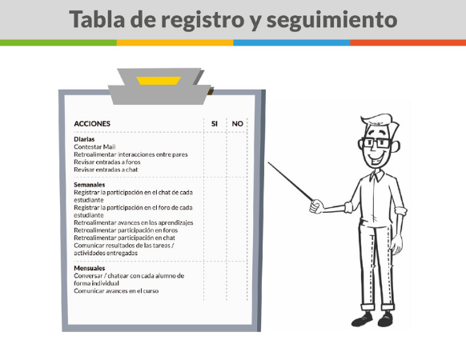

Probablemente a estas alturas del curso te estarás preguntando: ¿y cómo hago ahora para poner en práctica todo lo anterior? Llevar un registro de tus estudiantes, dar retroalimentación, participar del chat y contestar los mails de tus estudiantes no es tarea sencilla de organizar, para facilitar esta tarea te proponemos la siguiente actividad:  

**Manos a la obra**

I. Observa la siguiente tabla para evaluar tu rol como docente remoto.

[DESCARGUE TABLA AQUÍ](https://redqualitasedu-my.sharepoint.com/:i:/g/personal/ppenalva_redqualitas_edu_uy/ETmYm6KkNvpErxye0a67NKgBPrPzeX5dkilb-3pqWpGQRg?e=wYt7vQ)

II. Si tu nivel de dominio de Excel te lo permite realiza una planilla que te ayude a tener en un solo lugar toda la información de tus alumnos.   

III. Si no sabes cómo hacerlo revisa los siguientes tutoriales que pueden ser de gran ayuda.

> [!VIDEO https://www.youtube.com/embed/575W69TGVMw]

> [!VIDEO https://www.youtube.com/embed/iXW14plr_sY]

**Preguntas para la reflexión pedagógica:**

1.  **¿Cómo vas a estructurar tu tabla de seguimiento?**
2.  **¿Qué requiere de ti esta forma de llevar registros?**
3.  **¿Qué fortalezas visualizas en el trabajo remoto? ¿Qué desafíos te planteas?**